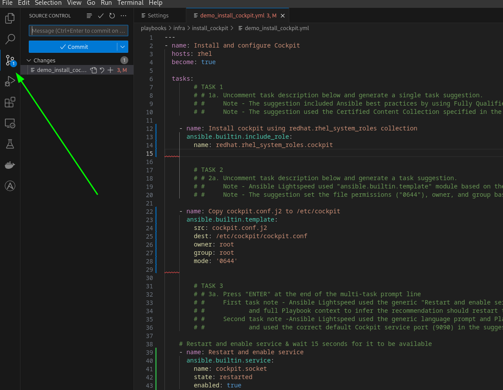
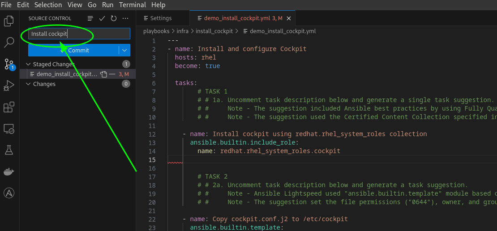

# Install and configure Cockpit using Ansible Lightspeed

## Overview

This Playbook installs Cockpit using the `redhat.rhel_system_roles` Certified Content collection, copies a custom configuration file, and restarts the `cockpit` service.  

The demo illustrates:

* Generates single and multi-task suggestions
* How Ansible Lightspeed uses the full Playbook context when generating a task.
* Uses a natural language task prompts to generate applicable, accurate Ansible code.


## Demo preparation if not using Instruqt environment

1. Install the VS Code extension and activate Ansible Lightspeed using resources in the [getting started guide](../../../docs/getting_started.md).
2. If not running this example in the Ansible self-paced labs environment, create an Ansible Inventory file with a `rhel` Ansible inventory group with the corresponding Linux target host(s) details.

* [Example Ansible inventory file](./inventory/inventory.yml)

```yaml
---
all:
  children:
    rhel:
      hosts:
        rhel-01:
          ansible_host: "Your Ansible target host"
  vars:
    ansible_ssh_private_key_file: 'Your SSH private key file'
    ansible_user: 'Your Ansible user'
    ansible_host_key_checking: false
```

## Tested content

The model continues to improve and evolve with each release and generated suggestions could differ from the examples provided. Tested content is available in the corresponding [`solution_install_cockpit.yml`](./solution_install_cockpit.yml) Playbook.

## Running the demo

Run the steps below in the [./playbooks/infra/install_cockpit/demo_install_cockpit.yml](./demo_install_cockpit.yml) Ansible Playbook.

### Step 1

#### Uncomment and generate task `- name: Install cockpit using redhat.rhel_system_roles collection`

* Used natural language prompt to generate syntactically correct Ansible Playbook task.
* Suggestion incorporated Ansible best practices and used Fully Qualified Collection Name (FQCN).
* Suggestion used the RHEL System Roles Certified Content Collection specified in the prompt.

### Step 2

#### Uncomment and generate task `- name: Copy cockpit.conf.j2 to /etc/cockpit`

* Ansible Lightspeed used `ansible.builtin.template` module based on the `.j2` file extension.
* The suggestion set the file permissions, owner, and group based on Ansible best practices.

### Step 3

#### Generate multi-task `# Restart and enable service & wait 15 seconds for it to be available`

* First task - Ansible Lightspeed used the generic "Restart and enable service" prompt and full Playbook context to infer the recommendation should restart the "cockpit" service.
* Second task - Ansible Lightspeed used the generic language prompt and Playbook context and used the correct default Cockpit service port (9090) in the suggestion.

## Executing the Playbook

You can can choose to run the `demo_install_cockpit.yml` Playbook using **Ansible automation controller** (formerly Ansible Tower) or  `ansible-navigator`.

### **Option 1: Using automation controller - Instruqt only!**

> [!WARNING]
> The automation controller instructions are specific to the pre-configured Instruqt environment.

#### Commit and push Playbook to repository

* In Visual Studio Code, click on the **Source Control** icon.

* Click on the **plus** icon next to the Playbook name.

* Add a commit message. For example:

```yaml
Install Cockpit
```



* Click on the **Commit** button.


* Click on the **Sync Changes** button to push the Playbook to the repo.


#### Run the `Deploy monitoring` Job template

* Go to the **Controller** tab and login using the credentials provided above if necessary.
* Click **Templates** under the **Resources** section in the Navigation Pane on the left hand side.
* Click the  icon on the right-hand side of the `Deploy monitoring` Job Template column.


* Give it a few moments for the job to complete and note the `Deploy monitoring` Job completed successfully!


### **Option 2: using ansible-navigator**

* Open a terminal in VS Code by clicking on `Terminal` and `New Terminal`.


* In the terminal window, navigate to the `playbooks/infra/install_cockpit/` folder.

```bash
cd playbooks/infra/install_cockpit
```

* Run the ansible-navigator command in the terminal

```bash
ansible-navigator run demo_install_cockpit.yml
```


* Press the `ESC` key to return to the prompt.

---
