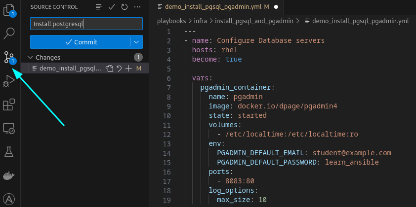
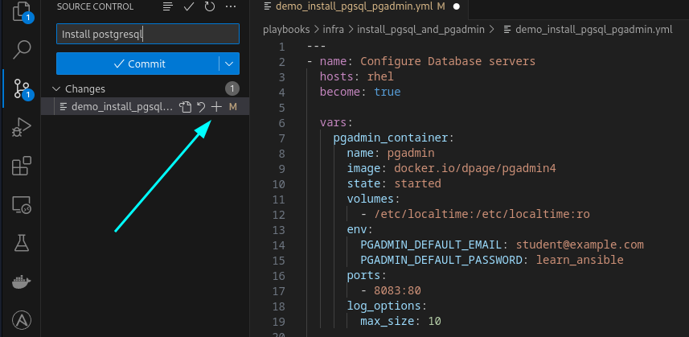
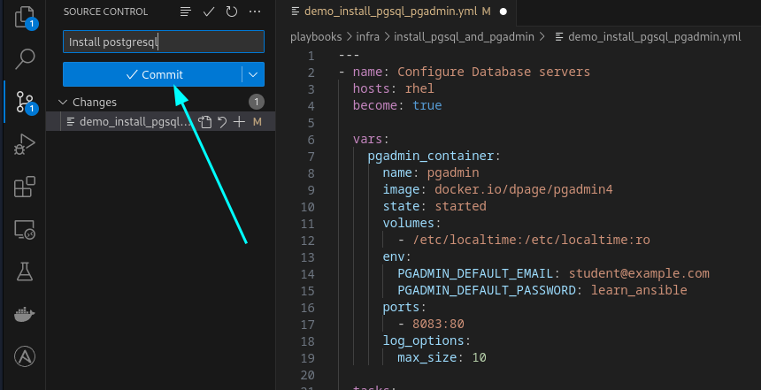
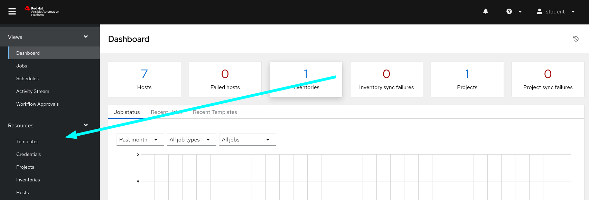
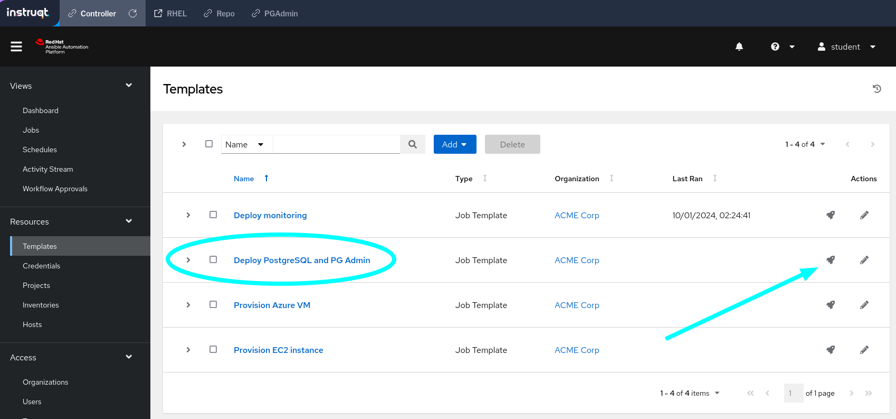
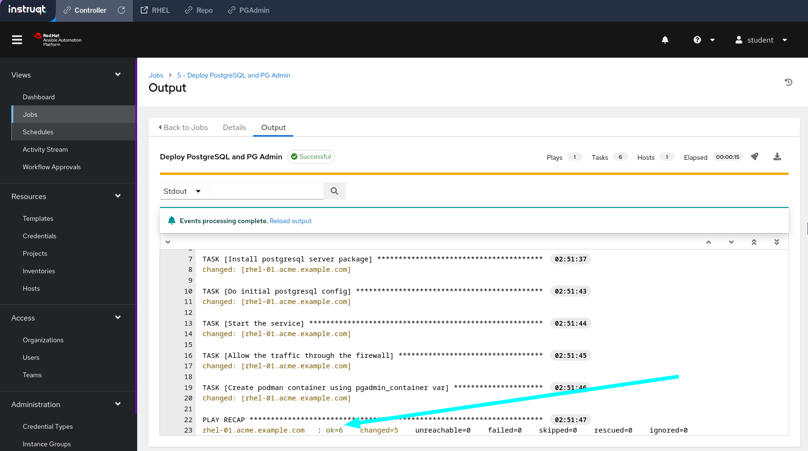
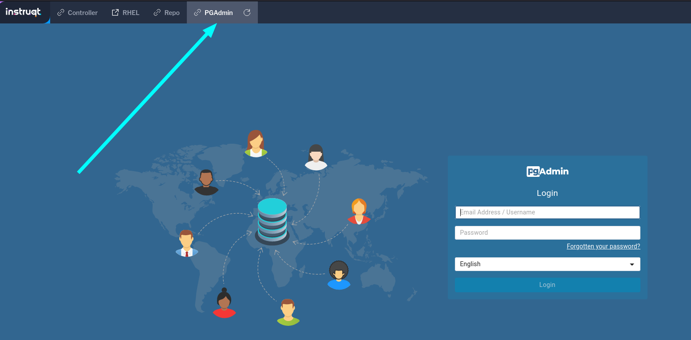

# Install and configure PostgreSQL and PGAdmin container using Ansible Lightspeed

## Overview


The demo performs the following tasks:

- Installs `postgresql-server`, initializes the database, and starts and enables the `postgresql` service.
- Configures the firewall for `postgresql` traffic.
- Uses `podman` to configure and run the **dpage/pgadmin4** container.

This demo illustrates the following Ansible Lightspeed features:

* Single and multi-line prompts.
* Translating easy-to-understand prompts into Ansible content.
* Using keywords, such us `....using X var`, in prompts to obtain desired suggestions.
* Using the full YAML file context to generate Ansible content with best practices.

## Demo preparation if not using Instruqt environment

1. Install the VS Code extension and activate Ansible Lightspeed using resources in the [getting started guide](../../../getting_started.md).
2. If not running this example in the Ansible self-paced labs environment, create an Ansible Inventory file with `rhel` Ansible inventory group with the corresponding Linux target host(s) details.

[Example Ansible inventory file](./inventory/inventory.yml)

```yaml
---
all:
  children:
    rhel:
      hosts:
        rhel-01:
          ansible_host: example-host # Update this to your target host.
  vars:
    ansible_ssh_private_key_file: "example-key" # Update this to your target host.
    ansible_user: example-user # Update this to your target host.
    ansible_host_key_checking: false
```

## Tested content

The model continues to improve and evolve with each release and generated suggestions could differ from the examples provided. Tested content is available in the corresponding [`solution_install_pgsql_pgadmin.yml`](./solution_install_pgsql_pgadmin.yml) Playbook.

## Running the demo

Run the steps below in the [./playbooks/infra/install_pgsql_and_pgadmin//demo_install_pgsql_pgadmin.yml](./demo_install_pgsql_pgadmin.yml) Ansible Playbook.

### Step 1

#### Uncomment and generate task `* name: Install postgresql server package`

- Used natural language prompt to generate syntactically correct Ansible Playbook task.
- Suggestion incorporated Ansible best practices and used Fully Qualified Collection Name (FQCN).

### Step 2

#### Generate multi-task `# Do initial postgresql config & start the service & allow the traffic through the firewall`

- First task - Ansible Lightspeed used simple language to correctly infer the correct terminal command. The generated task uses best practices and is idempotent.
- Second task - Ansible Lightspeed used the Playbook context to infer the `postgresql` service needs to start.
- Third task - Ansible Lightspeed used the correct default PostgreSQL TCP port, `5432` to start the service

### Step 3

#### Uncomment and generate task `- name: Create podman container using pgadmin_container var`

- Ansible Lightspeed integrated the `pgadmin_container` variable into the suggestions as requested in the prompt.

## Executing the Playbook

You can choose to run the `demo_install_pgsql_pgadmin.yml` Playbook using **Ansible automation controller** (formerly Ansible Tower) or  `ansible-navigator`.

> [!WARNING]
> The automation controller instructions are specific to the pre-configured Instruqt environment.

### **Option 1: Using automation controller - Instruqt only!**

> [!NOTE]
>The lab repository is hosted locally in the lab and no content is pushed to your GitHub account.

#### Commit and push Playbook to repository

- In Visual Studio Code, click on the **Source Control** icon.

- Click on the **plus** icon next to the Playbook name.

- Add a commit message. For example:

```yaml
Install postgresql
```


- Click on the **Commit** button.

- Click on the **Sync Changes** button to push the Playbook to the repo.  


#### Run the `Deploy PostgreSQL and PG Admin` Job template

- Go to the **Controller** tab and login using the credentials provided above if necessary.
- Click **Templates** under the **Resources** section in the Navigation Pane on the left hand side.

- Click the  icon on the right-hand side of the `Deploy PostgreSQL and PG Admin` Job Template column.

- Give it a few moments for the job to complete and note the `Deploy PostgreSQL and PG Admin` Job completed successfully!


### **Option 2: using ansible-navigator**

- Open a terminal in VS Code by clicking on `Terminal` and `New Terminal`.

```bash
cd playbooks/infra/install_pgsql_and_pgadmin
```

- Run the ansible-navigator command in the terminal

```bash
ansible-navigator run demo_install_pgsql_pgadmin.yml
```

- Press the `ESC` key to return to the prompt.

### Verify PG Admin is available

- Open the **PG Admin** tab on the top
- If the `demo_install_pgsql_pgadmin.yml` Playbook completed successfully, you should see the user interface in the tab.


> [!NOTE]
> If necessary, click on the refresh button to reload the **PG Admin** tab to display the UI.
>

---
